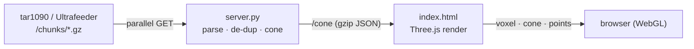

# ADSb-Vue — how it works

A walkthrough of the internals for someone comfortable with Python who wants to
understand, modify, or extend the code. It assumes you've skimmed the
[README](README.md) for what the thing *is*.

The whole app is two files and no build step:

- **`server.py`** — a zero-dependency (stdlib-only) HTTP server that turns your
  receiver's history into a compact JSON API.
- **`index.html`** — a single self-contained Three.js page that fetches that JSON
  and renders it in WebGL.



---

## The data source: tar1090 chunks

readsb (inside Ultrafeeder) keeps a rolling window of **recent history** so that
tar1090 can draw trails when you open the map. It exposes that as:

- `GET /chunks/chunks.json` — an index: `{ "chunks": ["chunk_<epoch_ms>.gz", ...] }`
- `GET /chunks/chunk_<epoch_ms>.gz` — each a **gzip-compressed JSON** blob (note:
  *not* the binary trace/heatmap format) shaped like:

  ```json
  { "files": [
      { "now": 1784412300.0,
        "aircraft": [ ["a4095f", 40000, 498.6, 224.3, 44.128, -96.506, ...], ... ] },
      ... ] }
  ```

Each `aircraft` entry is a compact positional array: `[hex, alt_ft, ground_speed,
track, lat, lon, ...]`. We only use indices 1 (alt), 4 (lat), 5 (lon).

We read *history* rather than the live `GET /data/aircraft.json` (which is only
the currently-tracked aircraft) because a coverage map is fundamentally an
*accumulation* — where have we ever heard something, and how far/low.

---

## The server (`server.py`)

Stdlib only: `http.server.ThreadingHTTPServer`, `urllib.request`, `gzip`, `json`,
`math`, `concurrent.futures`. That's a deliberate constraint — it runs anywhere
Python 3 does, no `pip install`, and the Docker image is a few MB.

### Configuration

All knobs are `ADSB_*` environment variables, read once at import (see the block
under `_load_dotenv`). `_load_dotenv()` is a ~10-line parser that reads a `.env`
file with `os.environ.setdefault`, so a real environment variable (or a
docker-compose `environment:` entry) always wins over the file — matching how
you'd expect precedence to work. `.env.example` documents every option.

Config splits into two intentional categories in the source:

- **Tunables** exposed as env vars: `ULTRAFEEDER`, `PORT`, `CACHE_SECS`,
  `MAX_CHUNKS`, `CELL_NM`, `ALT_BIN_FT`, `MAX_RANGE_NM`, `LOW_ALT_FT`,
  `FETCH_WORKERS`, `ANTENNA_AGL_FT` (antenna mast height, ft — used only by the
  client's terrain model, passed through the payload), and the appearance
  passthroughs `BORDER_COLOR` / `HOME_BORDER_COLOR` / `FOG_DENSITY` (`0` disables
  the distance fade).
- **Fixed constants** that are named but *not* configurable, because changing
  them would be wrong or meaningless: `BEARING_BINS = 361` (0–360° inclusive),
  `GZIP_MIN_BYTES = 1400` (~one MTU), `NM_PER_DEG`, `FT_PER_NM`.

### The build pipeline

`build_points()` is the heart. It produces the payload dict the API serves, in
one pass over every observation plus a small second pass for the cone. Its
collaborators:

- **`receiver()`** — the station's lat/lon. Env override, else auto-fetched once
  from tar1090's `/data/receiver.json` and memoized.

- **`iter_chunks(names)`** — a generator that downloads + gunzips + `json.loads`
  each chunk in a `ThreadPoolExecutor` (`FETCH_WORKERS` threads) and `yield`s the
  parsed docs via `as_completed` as they land. This is the parallelism: on a
  remote/high-latency feeder the serial round-trips dominate, and fanning them
  out is a large win (~4–5× at ~80 ms/chunk). On the same host it's marginal —
  there the cost is CPU-bound `json.loads` + the de-dup loop, which the GIL
  serializes anyway. Failed chunks are logged and skipped.

- **The de-dup pass** (inline in `build_points`) — for every aircraft row it
  computes a coarse grid key `(round(lat/STEP), round(lon/STEP), alt // ALT_BIN_FT)`
  and skips anything already in `seen`. This is the crux of why the payload stays
  small: we're building a *coverage map*, not replaying traffic, so ~1.5 nm × 1000 ft
  cells collapse millions of raw positions to a few hundred thousand distinct
  ones regardless of how much history we read. The `seen`-check happens **before**
  the trig, so ~90 % of rows cost nothing but a set lookup. Each kept point also
  carries the **earliest time its cell was heard** (`t`, epoch seconds); `seen`
  maps a cell to its point index so a later, earlier sighting can lower it. That
  `t` is what drives the client's timeline (see *Timeline playback* below), and
  the window's `min`/`max` become `t_min`/`t_max` in the payload.

- **`bearing_distance(sin1, cos1, rlat_r, rlon_r, alat, alon)`** — initial great-
  circle bearing (0°=N) and haversine distance in nm. The receiver terms
  (`sin`/`cos` of its latitude, its lat/lon in radians) are constant for a run,
  so they're hoisted into `build_points` and passed in rather than recomputed per
  row. Positions beyond `MAX_RANGE_NM` are dropped as bad data / MLAT noise.

- **`build_cones(points)`** — a second, cheap pass over the *kept* points that
  computes, per integer bearing, the farthest ground distance (`cone_all`) and
  the farthest distance seen below `LOW_ALT_FT` (`cone_low`). It's a derived
  statistic, so keeping it out of the hot de-dup loop reads more clearly and
  costs nothing meaningful (~300 k iterations).

The returned dict: `{ ok, ts, ultrafeeder, recv_lat, recv_lon, antenna_agl_ft,
border_color, home_border_color, fog_density, count, chunks, t_min, t_max,
points: [[brg, dist_nm, alt_ft, first_seen_epoch], ...], cone_all, cone_low }`.
The last handful (`antenna_agl_ft`, `border_color`, `home_border_color`,
`fog_density`) are pure config passthroughs the client reads for the terrain model
and appearance; the server doesn't use them itself.

### Caching & concurrency

`get_cone()` / `_ensure()` implement single-flight caching with **two** locks:

- `_cache_lock` guards only the fast read/write of the cache dict.
- `_build_lock` ensures just one thread rebuilds at a time.

The pattern is double-checked locking: read the cache under the fast lock and
return immediately if it's fresh; otherwise take the build lock, re-check (a peer
may have just rebuilt), and only then do the expensive `build_points()`. The
expensive work runs **outside** the cache lock, so a cache-hit reader is never
blocked behind an in-flight rebuild.

Crucially, `_ensure` also **serializes and gzips the payload once per rebuild**
and caches those bytes (`_cache["json"]`, `_cache["gz"]`). Every `GET /cone` then
just writes pre-baked bytes — no per-request `json.dumps` over the whole point
list, no per-request compression. `CACHE_SECS` controls staleness;
`?refresh=true` forces a rebuild.

### HTTP layer

A single `BaseHTTPRequestHandler`. `_send()` centralizes response writing and
handles gzip: for `/cone` the handler passes the already-compressed bytes with
`encoding="gzip"`; for other bodies (`index.html`) `_send` gzips on the fly when
the client accepts it and the body exceeds `GZIP_MIN_BYTES`.

| Route | Purpose |
|---|---|
| `GET /` (`/view`, `/index.html`) | the viewer page |
| `GET /cone` (`/data`) | the observation payload (`?refresh=true` bypasses cache) |
| `GET /cities` | optional per-deployment city labels: `cities.local.json` if present next to `server.py`, else `[]` (never 404 → no console noise; invalid JSON → `[]`) |
| `GET /health` | liveness |
| `GET /adsbvue_favicon.png`, `/favicon.ico`, `/adsbvue_logo.png` | static assets |
| `POST /_save?name=…` | debug-only: writes a posted canvas data-URL to `/tmp` (used for headless screenshot verification; harmless, unused by the app) |

---

## The frontend (`index.html`)

One `<script type="module">`. Three.js + `OrbitControls` come from `esm.sh`;
the US state outlines (`us-atlas` + `topojson-client`) and lakes (Natural Earth
via jsDelivr) are fetched at runtime. So the **viewer's browser** needs internet,
but the server only ever talks to your feeder on the LAN.

### Scene coordinate system

Everything is receiver-centric. `toXYZ(bearing, dist, alt)` maps a polar
observation to scene space: `x = dist·cos(brg)`, `z = dist·sin(brg)`, `y =
alt·ALT_SCALE`, with distance in nm used directly as scene units. North is `+X`,
east is `+Z` — the same convention `makeGeoToXZ` uses for the map layers, so the
geography and the aircraft line up.

`ALT_SCALE = 1/250` deliberately **exaggerates altitude ~2×**. Physically 45 kft
≈ 7.4 nm against a 250 nm radius, so true-to-scale the reception volume is a
nearly-flat pancake; the exaggeration makes it read as a dome without distorting
the interpretation.

### Render modes

`activePoints()` filters `DATA.points` by the enabled altitude-band checkboxes;
`rebuild()` disposes the old geometry and constructs the active mode. There are
three, all driven from the same point stream:

- **Density volume** (`buildVoxels`) — bins points into 3D cells (`CELL` nm
  horizontally, `ALT_CELL` ft vertically) and draws one `InstancedMesh` of
  `MeshLambertMaterial` boxes. Per-instance colour is the cell's mean-altitude
  hue scaled by `log(count)` brightness. Blending is **normal alpha, not
  additive** — additive blows out to white once thousands of translucent boxes
  overlap. The Solidity slider drives `material.opacity` and flips `depthWrite`
  on past ~0.82 so it reads as a solid object at the top of the range.

- **Detection cone** (`buildShell`) — the coverage *floor*: for each
  (azimuth, ground-range) cell, the **lowest altitude ever heard**. It's ~0 near
  the receiver and rises with range as the horizon hides low traffic — the
  classic detection cone, where local blockages show as dents and the ragged rim
  shows reach per bearing. Building it robustly is most of this function:
  interpolate interior gaps, fill empty bearings from neighbours, enforce
  non-decreasing-with-range (kills min-altitude sampling noise), smooth over
  azimuth/range with **ping-pong flat `Float32Array` buffers** (no per-cell
  allocation), clamp the apex rings to a shared mean (no central starburst), then
  triangulate only fully-populated quads so the outer edge stays honest.

- **Point cloud** (`buildPoints`) — every observation as an altitude-coloured
  `THREE.Points`. The simplest view; you can pick out individual airways.

`altColor(alt)` is the shared HSL ramp (hue sweeps ~28°→296° with altitude). An
ambient + directional light pair lets the Lambert surfaces shade when solid.

### Timeline playback

The Timeline panel animates coverage building up over the retained window using
each point's first-seen time (`t`). Scrubbing (paused) just re-filters
`activePoints()` by a cutoff and rebuilds once. **Playing** can't afford a rebuild
per frame, so it swaps in a per-mode *reveal* object that moves the cutoff every
frame with O(1) work, so the sweep stays at 60 fps:

- **points** — one geometry with vertices sorted by `t`; the cutoff is a
  `geometry.setDrawRange(0, k)` (binary-searched `k`). Stock material, identical look.
- **voxel** — one `InstancedMesh` with cells ordered by first-seen time; the
  cutoff is just `mesh.count = k`.
- **cone** — the floor surface genuinely reshapes as points are added, so there's
  no cheap threshold: it **precomputes ~60 frames** once on play (yielding to keep
  the UI responsive) and swaps the visible one by index.

Pausing/scrubbing snaps back to the accurate single-geometry static path. Loop and
a 0.5–4× speed control drive the rAF sweep.

### Exporting a clip

`exportClip()` records a play-through to WebM by **compositing**: an offscreen 2D
canvas draws the WebGL canvas (created `preserveDrawingBuffer: true`) plus a
burned-in overlay — the date/time of the current `playCut`, a window progress bar,
and a small wordmark — then `canvas.captureStream(30)` feeds a `MediaRecorder`
(vp9 → vp8 → webm). A gentle `controls.autoRotate` runs during capture, and a
wall-clock cap guarantees the recorder can't hang if the tab is backgrounded
mid-sweep. Feature-detected; the button disables where `MediaRecorder` /
`captureStream` are unavailable.

### Interaction & lifecycle

- **Mode** buttons and **altitude-band** checkboxes trigger `rebuild()`.
- **Solidity** slider updates materials live via `applyOpacity()` (no rebuild) —
  it traverses the current mode's meshes and sets opacity/`depthWrite` by a
  `userData.role` tag (fill / wire / points).
- **Smoothing** slider changes geometry, so it debounces a `rebuild()` (voxel
  cell size + cone smoothing passes).
- View presets, and **Refresh** which re-fetches `/cone?refresh=true`.
- On small / coarse-pointer screens the panel collapses behind a ☰ toggle (pure
  CSS media queries + one class toggle; desktop is untouched).

### Geography

`loadStateMap()` draws state borders, auto-highlighting the **home state(s)** by
point-in-polygon of the receiver against the state shapes (plus any border within
~35 nm), so it's correct at any deployment with no hardcoded list. It also draws
Natural Earth lakes within range and a labelled city list: the built-in
`DEFAULT_CITIES`, overridden by whatever `GET /cities` returns (a git-ignored
`cities.local.json`), so a deployment keeps its own labels across updates without
editing the tracked page. `flattenCities()` accepts either a flat
`[["City",lat,lon],...]` list or a grouped `{ "Group": [...], ... }` object (group
keys are for tidiness only — flattened for display) and drops malformed rows.
Border colours come from `border_color` / `home_border_color`; labels beyond
~500 nm are culled.

### Terrain — the predicted-horizon model

Optional, entirely client-side (keeps the server dependency-free) and degrades to
nothing if the tiles are unreachable. On demand it fetches open **Terrarium**
elevation tiles (AWS Open Data, `.../terrarium/{z}/{x}/{y}.png`, zoom 8 ≈ 430 m/px)
covering the receiver's disc, decodes elevation `= (R·256 + G + B/256) − 32768` m
into per-tile `Float32Array`s, and caches them.

`computePredictedFloor()` walks each of 120 bearings outward sampling the ground,
tracking the steepest grazing angle over terrain **and the earth's bulge**
(4/3-effective-earth radius), and reports the lowest altitude still in line of
sight at each range — the physical horizon the antenna is limited by. Antenna
height above sea level = the DEM elevation at the receiver + `antenna_agl_ft`.

- **▲ Predicted horizon** (`buildHorizon`) renders that floor as a translucent surface.
- **◑ Compare to horizon** recolours the measured cone by `measured − predicted`:
  green = matches, amber = higher than terrain allows, blue = below the horizon,
  grey = judged only where low traffic actually flew (`measured < COMPARE_CEIL_FT`);
  a small dead-zone treats near-matches as green.
- **⌇ Bearing profile** draws a side-on SVG slice for one bearing (picked by
  slider or a ground-plane raycast on click): terrain, the horizon line, and the
  actual hits — disambiguating an amber patch (hits on the line = good coverage;
  an empty low region = no low traffic, not a gap).

### Debugging hook

`window.__adsb` exposes `setMode/freeze/resume/stats` plus headless-test helpers
for the timeline (`seek/play/stop`), terrain (`terrain/terrainInfo/floorAt/elevFt`)
and export (`exportFrame`). The renderer is created with
`preserveDrawingBuffer: true`, so the render can be captured headlessly (freeze the
rAF loop, `canvas.toDataURL()`, POST to `/_save`). Handy because the usual
screenshot tooling struggles with a continuously-animating WebGL canvas.

---

## Performance decisions, in one place

- **Coarse server-side de-dup** — the single biggest lever; bounds payload and
  render cost independent of history depth.
- **Parallel chunk fetch** — hides feeder latency (`FETCH_WORKERS`).
- **Serialize + gzip once per rebuild**, cache the bytes — requests are byte
  copies, not re-serialization.
- **Single-flight cache** with split read/build locks — reads never block a
  rebuild.
- **Hoisted receiver trig** and a `seen`-check-before-trig ordering — keep the
  ~1.8 M-row hot loop lean.
- **Ping-pong flat buffers** in the cone smoother — no allocation churn per pass.

## Extending it

- New render mode: add a `build*()` that consumes `activePoints()` and returns a
  `THREE.Group`, wire it into `rebuild()` and a mode button.
- New analysis over the data: it's all in `build_points()` / `build_cones()`;
  add fields to the payload dict and read them in the page's `updateMeta()`.
- Different receiver network: everything keys off `/data/receiver.json` and the
  `/chunks/` endpoint, so any tar1090-compatible source works by pointing
  `ADSB_ULTRAFEEDER` at it.
