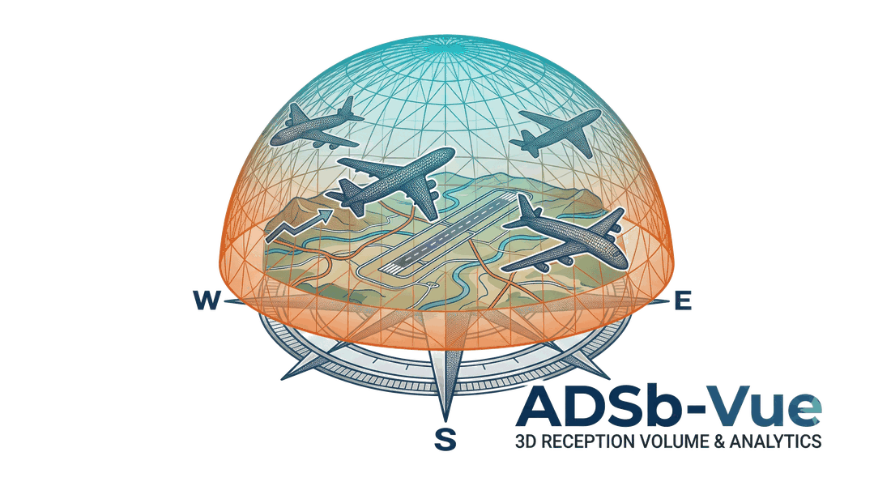

<p align="center">
  
</p>

# ADSb-Vue

A standalone **3D volumetric view of your ADS-B antenna reception**, driven by an
Ultrafeeder / tar1090 receiver. Inspired by the "detection cone" viewer, but with
switchable render modes and a true volumetric density render.

It reads tar1090's rolling recent-history chunks (`/chunks/chunks.json` +
`chunk_*.gz`), converts every aircraft observation to bearing / distance /
altitude relative to the receiver, and serves a self-contained Three.js page.

> For a more in-depth description of how the Python server and the Three.js
> frontend actually work, see **[DETAILS.md](DETAILS.md)**.

## Render modes (toggle in the UI)

- **Density volume** — observations binned into 3D cells drawn as translucent,
  colour-by-altitude blocks. Bright where reception is dense; you can see the
  low-altitude core near the receiver fade to high-altitude-only at the fringes.
- **Detection cone** — the *coverage floor*: the lowest altitude still heard at
  each bearing and range. ~0 near the receiver, rising with distance as the
  horizon hides low traffic. Dents = local blockage; the ragged rim = reach.
- **Point cloud** — every observation as an altitude-coloured point (the classic
  view; you can pick out individual airways).

Altitude-band checkboxes filter all three modes. The vertical axis is
exaggerated ~2× (45 kft ≈ 180 units vs 250 nm ≈ 250 units) so the naturally thin
altitude band reads as a dome rather than a pancake.

## Run

    python3 server.py

Zero third-party dependencies — Python 3 standard library only. Then open
`http://<this-host>:24556/`. (The page pulls Three.js + a US state outline from
public CDNs, so the *viewer's browser* needs internet; the server only talks to
your Ultrafeeder on the LAN.)

## Configuration

Everything is optional — on the same host as your feeder the defaults just work
(`ADSB_ULTRAFEEDER=http://127.0.0.1`, port `24556`). All settings are `ADSB_*`
environment variables:

| Var                | Default              | Meaning                                   |
|--------------------|----------------------|-------------------------------------------|
| `ADSB_ULTRAFEEDER` | `http://127.0.0.1`   | Base URL of your tar1090 instance         |
| `ADSB_PORT`        | `24556`              | Port to listen on                         |
| `ADSB_RECV_LAT`    | auto                 | Receiver latitude (else `/data/receiver.json`) |
| `ADSB_RECV_LON`    | auto                 | Receiver longitude                        |
| `ADSB_MAX_CHUNKS`  | `48`                 | Newest-first chunk cap (0 = all history)  |
| `ADSB_CELL_NM`     | `1.5`                | De-dup grid cell size (nm)                |
| `ADSB_ALT_BIN_FT`  | `1000`               | De-dup altitude bin (ft)                  |
| `ADSB_MAX_RANGE_NM`| `400`                | Discard positions farther than this (nm)  |
| `ADSB_LOW_ALT_FT`  | `10000`              | "Low altitude" cutoff for the low-alt range stat (ft) |
| `ADSB_FETCH_WORKERS`| `8`                 | Parallel chunk downloads (1 = serial; higher helps a remote feeder) |
| `ADSB_CACHE_SECS`  | `120`                | Seconds to cache parsed observations      |
| `ADSB_ANTENNA_AGL_FT`| `30`               | Antenna height above ground (ft) for the terrain horizon model |

Reading is coarse on purpose: this is a coverage map, not a traffic replay.
Raise `ADSB_MAX_CHUNKS` (e.g. `0`) for the fullest envelope at the cost of a
bigger payload and slower first load; lower `ADSB_CELL_NM` for finer detail.

### Setting them

**Docker — inline (simplest for a few settings).** Add an `environment:` block to
the `adsbvue` service in `docker-compose.yml`:

```yaml
services:
  adsbvue:
    build: .
    image: adsbvue:latest
    container_name: adsbvue
    network_mode: host
    restart: unless-stopped
    environment:
      - ADSB_ULTRAFEEDER=http://192.168.1.50
      - ADSB_MAX_CHUNKS=0
```

**Docker — `.env` file (tidier for many settings).** Copy `.env.example` to
`.env`, edit it, and point the service at it instead of an `environment:` block:

```yaml
services:
  adsbvue:
    build: .
    image: adsbvue:latest
    container_name: adsbvue
    network_mode: host
    restart: unless-stopped
    env_file: .env
```

Keep `.env` comments on their own line (not after a value). If you use *both*,
`environment:` entries win over `env_file:`.

**Apply your changes.** After editing `docker-compose.yml` or `.env`, re-run it to
recreate the container with the new settings:

```
docker compose up -d
```

Add `--build` (`docker compose up -d --build`) whenever the **code** changed too —
e.g. after a `git pull` — so the image is rebuilt. It's always safe to include
`--build`.

**Without Docker.** Export the vars (`ADSB_ULTRAFEEDER=... python3 server.py`) or
drop a `.env` next to `server.py` — it auto-loads one. A real environment
variable always overrides the file. Restart the process to pick up changes.

## Customizing the map

State borders and lakes are drawn automatically and the home state(s) are
highlighted based on your receiver's position — no editing needed.

The labelled **cities** default to a short upper-Midwest US example. To use your
own, copy the example to a git-ignored local file and edit that — it overrides the
built-in list and **survives every update**, so you never touch a tracked file:

    cp cities.local.json.example cities.local.json
    # edit cities.local.json — a JSON array of [ "label", lat, lon ] entries

The server serves it at `/cities`; only entries within range of the receiver are
drawn. If the file is absent, the built-in defaults are used. Under Docker, create
`cities.local.json` in the repo folder *before* `docker compose up --build` — the
Dockerfile copies it into the image at build time (rebuild after editing it).

## Terrain — predicted vs. measured coverage

Under **Terrain** in the panel, the viewer can compare what you *actually hear*
against what the surrounding terrain physically *lets* you hear. It's optional and
loads open elevation tiles in the browser on demand; if they can't be reached, the
rest of the app is unaffected. (There's also a **"? What am I seeing?"** button in
that section with the same explanation in-app.)

**▲ Predicted horizon** draws the lowest altitude an aircraft can fly and still be
in your antenna's line of sight, given the terrain around you and the earth's
curvature — a smooth bowl that's ~ground level at the receiver and rises with
distance. Set your mast height with `ADSB_ANTENNA_AGL_FT` (feet; the ground
elevation is read from the terrain automatically). A taller antenna sees over more
terrain and lowers the horizon.

**◑ Compare to horizon** recolours your measured detection cone by how it stacks
up against that horizon:

- **green** — you hear low traffic right down to the horizon: confirmed good coverage.
- **red** — the lowest aircraft you heard sits higher than terrain says it should.
- **blue** — you heard something *below* the predicted horizon: over-performing.
- **grey** — only high traffic flew here, so low-altitude coverage can't be judged.

Two things to keep in mind when reading it:

- **Grey isn't bad.** You still have coverage there — you're hearing aircraft — but
  no *low* traffic came through to grade it, so low-altitude performance is simply
  *unknown*, not poor. The comparison only applies where the measured floor is below
  ~18,000 ft (i.e. low traffic actually flew there).
- **Red is a clue, not a verdict.** It can mean a real gap (terrain or an obstruction
  blocking you), *or* just that the lowest plane that flew that way happened to be
  fairly high. The **side view** helps: the coloured region near the centre is the
  low-altitude floor, and green usually traces your busy arrival/departure corridors.

## Endpoints

- `GET /`        — the 3D viewer page
- `GET /cone`    — observations as JSON (`?refresh=true` bypasses the cache)
- `GET /cities`  — optional local city labels (your `cities.local.json`, else `[]`)
- `GET /health`  — liveness

## Run via Docker (recommended)

Easiest on the same host that runs Ultrafeeder — co-located, always-on,
near-zero impact. From a clone of this repo on that host:

    docker compose up -d --build

Then open `http://<host>:24556/`. Host networking lets the container read
tar1090 at `127.0.0.1:80` and serve the viewer on the host's `:24556`. To run it
somewhere else, use bridge networking and set `ADSB_ULTRAFEEDER` to your tar1090
host — see `docker-compose.yml`.

**Updating:** pull the latest code and rebuild —

    git pull && docker compose up -d --build

## Run as a service

See `adsbvue.service` (a systemd **user** unit — adjust the path and
`ADSB_ULTRAFEEDER` inside it first):

    cp adsbvue.service ~/.config/systemd/user/
    systemctl --user daemon-reload
    systemctl --user enable --now adsbvue
    loginctl enable-linger "$USER"   # keep it running across logout

It can run on any host that can reach your Ultrafeeder.

## License

MIT — see [LICENSE](LICENSE).
